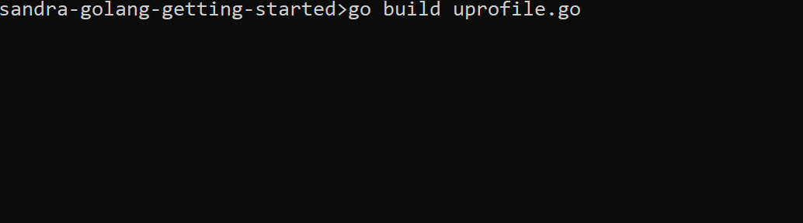
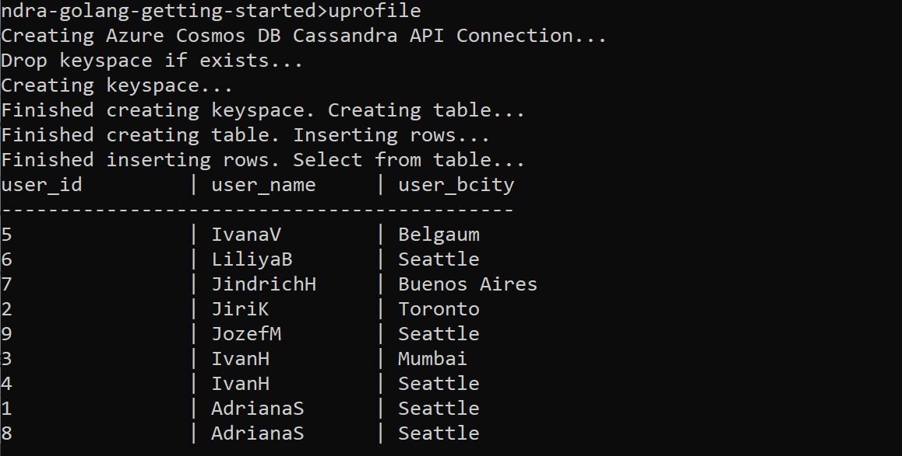

# Quickstart: Connect a Go application to Azure Cosmos DB Cassandra API

Azure Cosmos DB is a globally distributed multi-model database. One of the supported APIs is the Cassandra API. This sample walks you through creation of keyspace, table, inserting and querying the data using the gocql driver. 

## Getting Started

### Prerequisites

- An Azure account with an active subscription. [Create one for free](https://azure.microsoft.com/free). 
- An active Azure Cassandra API account - If you don't have an account, refer to the [Create a Cassandra API account](https://docs.microsoft.com/en-us/azure/cosmos-db/create-cassandra-nodejs) article.
- [Go](https://golang.org/) installed on your computer, and a working knowledge of Go.
- [Git](https://git-scm.com/downloads).

### Setup

Clone the application

```bash
git clone https://github.com/Azure-Samples/azure-cosmos-db-cassandra-golang-getting-started
```

### Installation

To configure the application, open `cassandra.go` and replace `ACCOUNTNAME` and `PASSWORD` with values from the portal.  

### Use the X509 certificate

1. Download the Baltimore CyberTrust Root certificate locally from [https://cacert.omniroot.com/bc2025.crt](https://cacert.omniroot.com/bc2025.crt). 

> If you are using a Windows machine, ensure that you have followed the process for properly converting a .crt file into the Microsoft .cer format below. Double-click on the .crt file to open it into the certificate display. 
>
> Click `Copy to File`.
>
> 
>
> Press Next on the Certificate Wizard. Select Base-64 encoded X.509 (.CER), then Next.
>
> 
>
> Select Browse (to locate a destination) and type in a filename.
> Select Next then Finished.
>
> You should now have a properly formatted .cer file. 

2. Change the `<path/to/cert.cer>` in `cassandra.go` to point to your new certificate.

3. Save `cassandra.go`.

Open up a command window, navigate to where you cloned the application and build it (using `go build`). This should create a cassandra.exe file in the same directory. 



### Running the sample

Run the sample from the same directory by typing `cassandra` and hitting return. You should see the following output:




